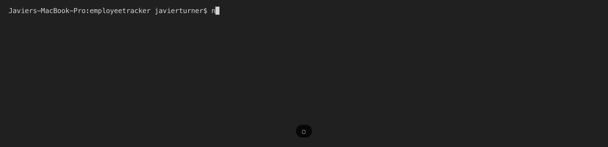

# Employee Tracker

##Description:
This application combines Node, Inquirer, and MySql to allow employers to keep track of their employees. They can also view and manage departments and roles. is a content management system that employers can use to keep track of their employees. 

##Screenshots of completed application

##Installation:
Step 1: In Github, create a clone of the repository
Step 2: Navigate to folder location in your terminal
Step 3: Run 'npm install' in your terminal to install dependencies
Step 4: Copy the information from 'schema.sql' and 'seeds.sql' into MySQLWOrkbench
Step 5: Now that everything is installed, run 'node server.js' and follow prompts

##Credits:
TA's
Classmates (DeVante Bailey, Corey Marshman)

##License

MIT License

Copyright (c) 2019 Javier Turner

Permission is hereby granted, free of charge, to any person obtaining a copy
of this software and associated documentation files (the "Software"), to deal
in the Software without restriction, including without limitation the rights
to use, copy, modify, merge, publish, distribute, sublicense, and/or sell
copies of the Software, and to permit persons to whom the Software is
furnished to do so, subject to the following conditions:

The above copyright notice and this permission notice shall be included in all
copies or substantial portions of the Software.

THE SOFTWARE IS PROVIDED "AS IS", WITHOUT WARRANTY OF ANY KIND, EXPRESS OR
IMPLIED, INCLUDING BUT NOT LIMITED TO THE WARRANTIES OF MERCHANTABILITY,
FITNESS FOR A PARTICULAR PURPOSE AND NONINFRINGEMENT. IN NO EVENT SHALL THE
AUTHORS OR COPYRIGHT HOLDERS BE LIABLE FOR ANY CLAIM, DAMAGES OR OTHER
LIABILITY, WHETHER IN AN ACTION OF CONTRACT, TORT OR OTHERWISE, ARISING FROM,
OUT OF OR IN CONNECTION WITH THE SOFTWARE OR THE USE OR OTHER DEALINGS IN THE
SOFTWARE.